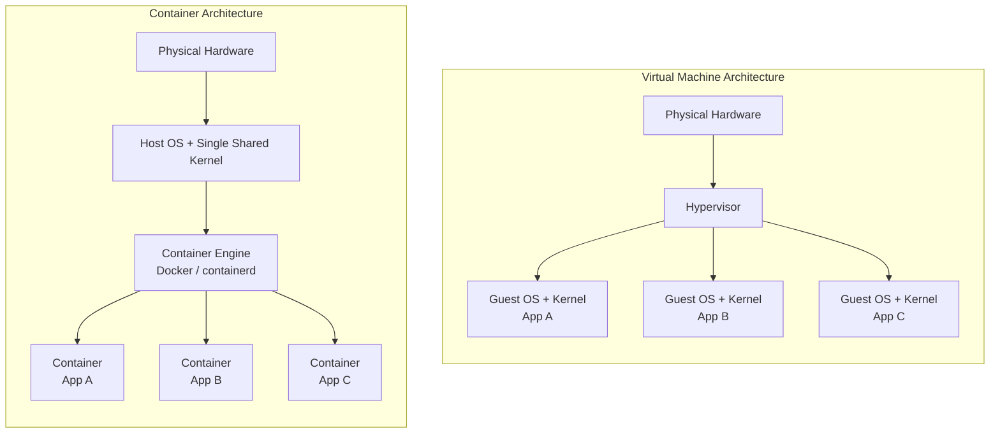
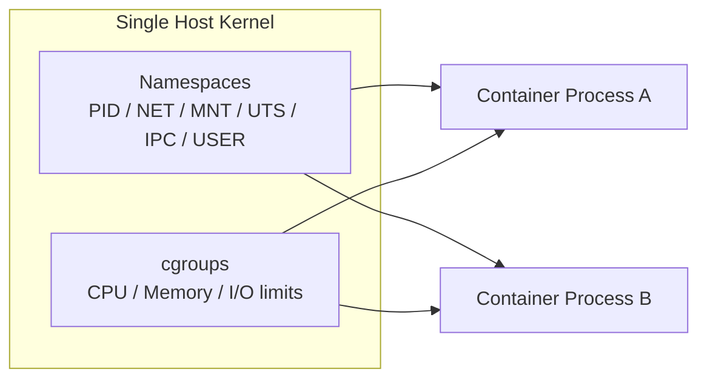

# Module 1: Container Fundamentals — Conceptual Foundation

**Duration:** 3 hours · **Prerequisite Module:** None (Linux fundamentals assumed) · **Unlocks:** Module 2 — Docker Basics

---

### 1. Learning Objectives

By the end of this module, you will be able to:
- Explain why containers exist and what specific operational problem they solve
- Differentiate containers from virtual machines at the architecture level, not just the marketing level
- Describe the OCI (Open Container Initiative) image and runtime specifications conceptually
- Distinguish clearly between an image, a container, and a registry
- Judge, given a workload description, whether containerization is the right architectural fit

---

### 2. Prerequisites

From your assumed baseline (not from a prior module, since this is Module 1):
- Comfortable with `ps`, `top`, `kill` — you understand a "process" as an OS-level concept
- Comfortable with file permissions (`chmod`, `chown`)
- Basic networking: IP addresses, ports, DNS resolution at a conceptual level
- Shell basics: pipes, redirection, environment variables

> 📝 NOTE: This module has almost no new commands. That's intentional — the mental model has to be right before the CLI means anything. If you skip this module, Module 2's commands will feel like memorization instead of engineering.

---

### 3. Theory

A **container** is not a small virtual machine. It is a set of isolated Linux processes that share the host's kernel but are walled off from each other and the host using kernel features — namespaces (what a process can *see*) and cgroups (what a process can *use*).

A **virtual machine** virtualizes hardware. Each VM runs its own full kernel, its own init system, its own drivers — a complete operating system stacked on top of a hypervisor, which itself sits on the host OS.

That single distinction — **shared kernel vs. own kernel** — is the root of almost every practical difference you'll encounter between Docker and VMs: startup time, image size, density per host, and the shape of the security boundary.



**Design notes for a visual designer:** two side-by-side stacks. The VM stack should visually emphasize three *separate, full-height* OS layers (thick blocks) between hardware and app — communicating "heavy, duplicated." The container stack should show *one* thin OS/kernel layer with three narrow app slices sitting directly on the container engine — communicating "light, shared." Use consistent block height per layer type across both diagrams so the size difference reads instantly, even color-blind-safe (e.g., use hatching/pattern in addition to color to distinguish OS vs app layers).

---

### 4. Conceptual Explanation — Why Before How

**The problem containers solve:** "it works on my machine." Before containers, an application's behavior depended on the exact state of the host it ran on — installed libraries, OS patch level, environment variables, file paths. Moving an app from a developer's laptop to a test server to production meant re-creating that state by hand, and small drifts caused outages.

Containers solve this by packaging the application **together with its runtime dependencies** (but not the kernel) into a single portable unit — the image. That image runs identically wherever a compatible container engine exists, because everything above the kernel is now part of the artifact instead of part of the host.

VMs solved a *different* problem first — hardware consolidation, letting one physical server safely run multiple OS instances for different tenants or workloads. Containers assume that problem is already handled (usually one VM already) and solve process-level isolation and packaging on top of it. This is why in production you very often see **containers running inside VMs**, not containers *replacing* VMs — the two solve different layers of the same problem.

> 💡 TIP: If someone asks "don't containers replace VMs?" the precise answer is "they solve a different problem at a different layer, and in most cloud environments you'll find both."

---

### 5. Internal Architecture

At a conceptual level (full technical depth arrives in Module 14 — Docker Internals):

- **Namespaces** give a process its own isolated *view* of system resources — its own process tree (PID namespace), its own network stack (NET namespace), its own filesystem mount table (MNT namespace), its own hostname (UTS namespace), and more. A containerized process still runs on the same kernel as everything else on the host — it just can't *see* the rest.
- **cgroups (control groups)** limit and account for *how much* of a resource a process or group of processes can use — CPU, memory, I/O. This is what stops one container from starving the whole host.
- **Union/layered filesystems** (OverlayFS in most modern setups) let an image be built as a stack of read-only layers, with a thin writable layer added on top at container runtime. This is why images share disk space efficiently and why containers start in milliseconds instead of minutes — there's no OS to boot, just a process to launch inside an already-prepared filesystem view.



> 📝 NOTE: A container, from the kernel's point of view, is just a regular process with some namespace and cgroup restrictions attached. There is no special "container mode" in the Linux kernel — this is why `ps aux` on the host can show container processes directly.

---

### 6. Practical Demonstration

Let's run one container to make this concrete before Module 2's deep CLI dive.

```bash
docker run hello-world
```

Expected output:
```
Unable to find image 'hello-world:latest' locally
latest: Pulling from library/hello-world
2db29710123e: Pull complete
Digest: sha256:...
Status: Downloaded newer image for hello-world:latest

Hello from Docker!
This message shows that your installation appears to be working correctly.
...
```

What just happened, mapped to the theory above:
1. Docker checked locally for the `hello-world` image — not found
2. It pulled the image (a stack of read-only layers) from Docker Hub, a public **registry**
3. It created a **container** — a new process, wrapped in fresh namespaces, with a thin writable layer on top of the image
4. It ran the container's default process, which printed the message and exited
5. Because the process exited, the container stopped — a container's lifecycle is tied to its main process, not to a "machine" being on or off

```bash
docker ps -a
```

Expected output:
```
CONTAINER ID   IMAGE         COMMAND    CREATED         STATUS                     NAMES
3f2a1b9c8d7e   hello-world   "/hello"   2 minutes ago   Exited (0) 2 minutes ago   quirky_euler
```

Notice: the container still *exists* (in a stopped state) after its process exits. This is a deliberate design decision you'll rely on constantly for debugging in later modules — a stopped container's logs and metadata are still inspectable.

---

### 7. Guided Hands-On Lab

**Goal:** observe process isolation directly, without yet needing Module 2's full CLI vocabulary.

**Step 1 — Confirm Docker is installed and BuildKit is active:**
```bash
docker version
docker info | grep -i "build"
```
Expected: client and server versions both print (26.x+), and BuildKit-related output appears in `docker info`.

**Step 2 — Run a long-lived container so we can inspect it while running:**
```bash
docker run -d --name isolation-demo alpine sleep 300
```
Expected output: a container ID is printed, and the container starts in the background (`-d` = detached).

**Step 3 — Compare process views from inside vs. outside the container:**
```bash
docker exec isolation-demo ps aux
```
Expected output (inside the container's PID namespace):
```
PID   USER     TIME  COMMAND
    1 root      0:00 sleep 300
   ...
```
Notice: `sleep 300` is PID 1 *inside* the container — it thinks it's the very first process on the system, even though on the host it's just one process among hundreds.

**Step 4 — Now check from the host:**
```bash
ps aux | grep sleep
```
Expected output: the same `sleep 300` process appears, but with a normal high host-level PID (e.g., `47213`), proving it's the same kernel-level process viewed through two different namespace lenses.

**Step 5 — Clean up:**
```bash
docker rm -f isolation-demo
```

**Verification checklist:**
- [ ] `docker version` shows Docker Engine 26.x or later
- [ ] The container's process appears as PID 1 inside, but a normal PID on the host
- [ ] You can articulate, in one sentence, why those two views of the same process differ

---

### 8. Independent Exercise

Without step-by-step guidance, complete the following and be ready to explain each result:

1. Run `docker run -d --name mem-demo alpine sleep 300`
2. Find the container's memory limit and current usage using a single Docker command (hint: it's not `docker inspect` alone — think about what shows *live* resource usage)
3. Find the container's host-level PID
4. Remove the container

<details>
<summary>Solution</summary>

```bash
docker run -d --name mem-demo alpine sleep 300
docker stats mem-demo --no-stream
docker inspect --format '{{.State.Pid}}' mem-demo
docker rm -f mem-demo
```

`docker stats` shows live cgroup-derived resource usage; `docker inspect --format '{{.State.Pid}}'` extracts the host-level PID from the container's metadata — the same PID you'd find by grepping `ps aux` on the host.
</details>

---

### 9. Mini Project

**"Container vs. VM Footprint Report"**

Deliverable: a short written comparison (half a page is enough) answering, with evidence:
1. Time how long `docker run --rm alpine echo "started"` takes from a cold pull to output, using `time`:
   ```bash
   time docker run --rm alpine echo "started"
   ```
2. Note the on-disk size of the `alpine` image:
   ```bash
   docker images alpine
   ```
3. Research (don't measure) the typical boot time and disk footprint of a minimal VM image (e.g., a minimal Ubuntu cloud image) from official documentation or a reputable source
4. Write 3–5 sentences explaining *why* the numbers differ, referencing the shared-kernel vs. own-kernel distinction from Section 3 — not just restating the numbers

> 🎯 INTERVIEW: This exact comparison — "why is a container faster to start than a VM" — is one of the most common junior-level Docker interview questions. Being able to explain it from the kernel-sharing mechanism, not just "containers are lighter," is what separates a memorized answer from an understood one.

---

### 10. Enterprise Case Study

**Scenario:** A mid-size fintech company runs 40 microservices, each currently deployed on its own dedicated VM for "isolation and simplicity." Infrastructure costs have grown linearly with service count, and provisioning a new VM for a new service takes 2 days through the internal ticketing process.

**Engineering decision points:**
- **Consolidation:** Multiple containers can run on a shared pool of fewer, larger VMs, since container-level isolation reduces (but doesn't eliminate) the need for VM-level isolation between services
- **Provisioning speed:** A new containerized service can be scheduled onto existing capacity in seconds instead of requesting new VM capacity
- **What doesn't change:** Services with genuinely different security tenancy requirements (e.g., handling PCI-scoped cardholder data alongside untrusted third-party code) may still warrant separate VM-level isolation *underneath* the containers — containerization reduces overhead, it doesn't erase the need for strong isolation boundaries where they're actually required

**What an experienced engineer would do differently from a naive "containerize everything" approach:** segment services by trust boundary *first*, then decide container placement within each boundary — rather than assuming containerization alone satisfies a compliance-driven isolation requirement.

> 🔒 SECURITY: This is the first appearance of a theme that recurs through the whole course: containers isolate *well enough for most purposes*, but shared-kernel isolation is not equivalent to hypervisor-level isolation. Module 9 goes deep on hardening this gap.

---

### 11. Production Scenario

**"You're on-call."**

A stakeholder pings you: *"I noticed the new containerized version of the billing service uses 300MB of RAM instead of the old VM's 2GB. That seems too good to be true — are we cutting corners on isolation to get this?"*

**How to respond, using only this module's concepts:**
- The RAM difference isn't a corner being cut — the old VM's 2GB included a full guest OS, kernel, and often unused system services; the container's 300MB is just the application process plus its own runtime, because it shares the host kernel instead of running its own
- Isolation is still present — it's implemented differently (namespaces/cgroups vs. a hypervisor), with a different threat model, not a weaker one by default
- If the stakeholder's concern is *specifically* about a compliance requirement mandating hypervisor-level isolation, that's a legitimate follow-up question worth escalating — the answer isn't "trust me," it's "let's check what the actual isolation requirement is and confirm our container platform's isolation posture satisfies it" (topic revisited in Module 9)

---

### 12. Troubleshooting — Diagnostic Methodology

Even at this conceptual stage, one systematic question resolves most early confusion:

> **"Is this a host-level problem or a container-level (namespace/cgroup) problem?"**

**Worked example — `docker run hello-world` fails with a pull error:**

```
docker: Error response from daemon: Get "https://registry-1.docker.io/v2/": dial tcp: lookup registry-1.docker.io: no such host.
```

Diagnostic steps:
1. **Is this host-level networking or Docker-level?** Test host DNS independent of Docker: `nslookup registry-1.docker.io`
2. If host DNS fails → this is not a Docker problem at all; it's host/network configuration (proxy, firewall, DNS server)
3. If host DNS succeeds but Docker still fails → check Docker daemon's own DNS configuration (`docker info`, daemon.json) — the daemon can have network configuration independent of the host
4. **Root cause:** most often a corporate proxy or DNS server not propagated into Docker's own network namespace

This "which layer is responsible" question is the same diagnostic instinct you'll use for every incident type in later modules — image pulls, container-to-container networking, and OOM kills all start with "which layer owns this."

---

### 13. Common Mistakes

1. **"A container is a lightweight VM."** It's not a VM at all — it's an isolated process. This misconception leads directly to mistake #2.
2. **Running a full init system (e.g., systemd) inside a container to manage multiple services**, treating the container like a mini-server instead of a single-process unit. This defeats most of the lifecycle and isolation benefits you'll learn to rely on starting in Module 4.
3. **Assuming container isolation is equivalent to VM isolation for security purposes** without checking the actual threat model — shared kernel means a kernel-level exploit can affect every container on the host.
4. **Confusing "image" and "container"** — saying "I'm going to edit the container" when you mean the Dockerfile/image, or expecting a stopped container to have the same guarantees as a fresh image.
5. **Assuming a container needs a full OS filesystem to run anything** — many production images intentionally contain nothing but a single static binary and no shell at all.

---

### 14. Best Practices

- Think in terms of **processes**, not machines, from day one — this mental model pays off in every later module, especially Compose (M7) and Kubernetes readiness (M15)
- Treat containers as **ephemeral and disposable** — never plan to "SSH in and fix" a running container as a long-term strategy
- When explaining containers to non-engineers, lead with the *packaging/portability* problem they solve, not the kernel mechanics — the mechanics matter for engineering decisions, not for stakeholder conversations

---

### 15. Anti-patterns

- **The "fat container"** — cramming a database, a web server, and a cron daemon into one container via systemd or supervisord, because it "feels more like a familiar VM." This anti-pattern will resurface explicitly in Module 4 with the one-process-per-container principle.
- **Treating container isolation as a substitute for network segmentation or IAM** — isolation at the process level doesn't replace isolation at the network or identity level.

---

### 16. Performance Considerations

- Container startup is fast primarily because there's no kernel boot — the "cost" of starting a container is closer to `fork()`/`exec()` than to booting an OS
- Because images are layered, a locally-cached base layer means pulling a new image with the same base is fast — this becomes central to build performance in Module 10
- Density: because containers don't duplicate the OS, significantly more containers than VMs can run on identical hardware for equivalent-sized workloads — this is the primary cost driver behind the Enterprise Case Study in Section 10

---

### 17. Security Considerations

- Shared kernel = shared attack surface. A kernel vulnerability can potentially be leveraged to escape container isolation in a way that has no VM equivalent (a VM guest kernel bug doesn't typically expose the hypervisor's other guests)
- Default Docker containers run as root *inside* the container unless explicitly configured otherwise — this doesn't mean root *on the host*, but it's a frequently misunderstood distinction that gets addressed properly with capabilities and rootless mode in Module 9
- Isolation strength is **configurable, not fixed** — namespaces, cgroups, capabilities, seccomp, and AppArmor/SELinux profiles all affect the actual isolation boundary, and default settings are not automatically the most secure settings

> 🔒 SECURITY: Remember this sentence — you'll be tested on the reasoning behind it in Module 9's Knowledge Check: "Container isolation is a spectrum controlled by configuration, not a fixed security boundary equivalent to a VM."

---

### 18. Interview Preparation

**Junior:**
- *Q: What is a container?*
  **Ideal answer:** An isolated process (or group of processes) that shares the host kernel but has its own restricted view of the filesystem, network, and process tree, achieved via namespaces and cgroups.
  **Common incorrect answer:** "A lightweight virtual machine" — this conflates two different isolation mechanisms and will usually prompt a follow-up question you won't be able to answer.

**Mid-level:**
- *Q: Why do containers start faster than VMs?*
  **Ideal answer:** No guest OS/kernel needs to boot — the container engine just creates namespaces/cgroups around a process that's ready to run against an already-prepared filesystem layer.
  **Common incorrect answer:** "Because Docker is optimized/faster software" — true but not the actual architectural reason being tested.

**Senior:**
- *Q: When would you choose a VM over a container for a given workload?*
  **Ideal answer:** When the isolation requirement is genuinely at the kernel/hypervisor level — e.g., multi-tenant workloads with untrusted code, strict regulatory isolation mandates, or needing a different kernel/OS than the host provides. Also acknowledges that in practice, many production systems use both layered together.
  **Common incorrect answer:** "Never, containers are strictly better" — signals the candidate hasn't internalized that containers and VMs solve different problems at different layers.

**Scenario:**
- *Q: A stakeholder claims containers are "less secure" than the VM-based system they're replacing. How do you respond?*
  **Ideal answer:** Acknowledge the isolation model is genuinely different, not automatically weaker, and offer to evaluate the specific security requirement (e.g., compliance mandate) against the container platform's actual configuration (capabilities, seccomp, rootless mode) rather than dismissing the concern.

**Whiteboard:**
- *Prompt: Draw the architectural difference between three VMs and three containers on the same physical host.*
  **Ideal answer:** Matches the Section 3 diagram — three full OS/kernel stacks under a hypervisor vs. one shared kernel under a container engine with three process-level isolated units.

**Troubleshooting:**
- *Q: `docker run hello-world` fails with a DNS resolution error. Walk through your diagnostic approach.*
  **Ideal answer:** Follows the Section 12 methodology — isolate whether the failure is host-level (test host DNS directly) or Docker-daemon-level (check daemon network config) before touching Docker-specific configuration.

---

### 19. Knowledge Check

**Multiple Choice 1:**
What is the primary architectural difference between a container and a VM?
- A) Containers use less disk space
- B) **Containers share the host kernel; VMs each run their own kernel** ✅
- C) Containers cannot run on cloud infrastructure
- D) VMs are only used for legacy applications

*Why the distractors are wrong:* (A) is a *consequence*, not the cause — tests whether the learner conflates symptom with mechanism. (C) is factually false and tests a common but baseless assumption. (D) is an outdated generalization that doesn't reflect current cloud architecture (containers commonly run *inside* VMs in the cloud).

**Multiple Choice 2:**
Which Linux kernel feature restricts *how much* CPU or memory a container can use?
- A) Namespaces
- B) **cgroups** ✅
- C) OverlayFS
- D) The container registry

*Why the distractors are wrong:* (A) namespaces control *visibility*, not resource limits — the single most common mix-up at this stage. (C) OverlayFS is about filesystem layering, unrelated to resource accounting. (D) a registry is just image storage/distribution, with no runtime role at all.

**Multiple Choice 3:**
A stopped container (`docker ps -a` shows `Exited (0)`) —
- A) No longer exists and cannot be inspected
- B) **Still exists on disk with its metadata and logs intact until explicitly removed** ✅
- C) Automatically restarts after 60 seconds
- D) Has had its image deleted

*Why the distractors are wrong:* (A) contradicts the Section 6 demonstration directly. (C) describes restart-policy behavior, which is opt-in and covered in Module 4, not default behavior. (D) confuses container removal with image removal — two independent operations.

**Short Answer:**
In 2–3 sentences, explain why a container process shows PID 1 when viewed from inside the container, but a different (host) PID when viewed from `ps aux` on the host.

**Practical Exercise:**
Start a container named `check-me` running `sleep 120`, retrieve its host-level PID using `docker inspect`, then remove it. Time estimate: 3 minutes.
```bash
docker run -d --name check-me alpine sleep 120
docker inspect --format '{{.State.Pid}}' check-me
docker rm -f check-me
```

---

### 20. Summary

Containers are isolated processes, not lightweight VMs — the shared-kernel model, implemented via namespaces (visibility) and cgroups (resource limits), is what produces every practical difference you'll rely on going forward: fast startup, small footprint, high density, and a security model that's configurable rather than fixed. VMs and containers solve problems at different layers and very often coexist in the same production system rather than one replacing the other. Everything from here forward — the CLI in Module 2, Dockerfiles in Module 3, security hardening in Module 9 — builds directly on this mental model.

---

### 21. Study Notes

- Container = isolated process(es), shared kernel. VM = full guest OS, own kernel, hypervisor-managed.
- Namespaces = visibility isolation (PID, NET, MNT, UTS, IPC, USER, CGROUP namespaces).
- cgroups = resource limit/accounting (CPU, memory, I/O).
- OverlayFS = layered, copy-on-write filesystem enabling fast image reuse and small incremental layers.
- A stopped container retains metadata/logs until explicitly removed (`docker rm`).
- Container isolation strength is configuration-dependent, not fixed — revisited heavily in Module 9.
- Containers commonly run *inside* VMs in production cloud environments — not a replacement relationship.

---

### 22. Cheat Sheet

| Command | Purpose |
|---|---|
| `docker version` | Show client + server (daemon) version |
| `docker info` | Show daemon-wide configuration, including BuildKit status |
| `docker run <image>` | Create and start a container from an image |
| `docker run -d --name <name> <image> <cmd>` | Run detached, named container |
| `docker ps` | List running containers |
| `docker ps -a` | List all containers, including stopped |
| `docker exec <container> <cmd>` | Run a command inside a running container |
| `docker inspect <container>` | Full JSON metadata for a container |
| `docker inspect --format '{{.State.Pid}}' <container>` | Extract just the host PID |
| `docker stats <container> --no-stream` | One-shot live resource usage snapshot |
| `docker rm -f <container>` | Force-remove a container (running or stopped) |

> 💡 TIP: `--format` with Go templates (as in the PID example) is worth getting comfortable with early — it turns `docker inspect`'s wall of JSON into scriptable, single-value output you'll use constantly in later troubleshooting modules.

---

### 23. Further Reading

- **Official docs:** [Docker Overview and Architecture](https://docs.docker.com/get-started/overview/), [OCI Runtime Specification](https://github.com/opencontainers/runtime-spec)
- **Books:** *Docker Deep Dive* — Nigel Poulton; *The Docker Book* — James Turnbull
- **GitHub repos:** [opencontainers/runtime-spec](https://github.com/opencontainers/runtime-spec), [opencontainers/image-spec](https://github.com/opencontainers/image-spec)
- **Practice platforms:** Play with Docker (labs.play-with-docker.com)
- **Certification path context:** Docker Certified Associate (DCA) exam objectives cover this exact container-vs-VM foundation in its first domain

---

## Glossary (New Terms This Module)

| Term | Definition |
|---|---|
| Container | An isolated process (or group of processes) sharing the host kernel, restricted via namespaces and cgroups |
| Virtual Machine (VM) | A virtualized computer with its own full guest OS and kernel, managed by a hypervisor |
| Namespace | A Linux kernel feature that gives a process its own isolated *view* of a system resource (PID, network, mounts, etc.) |
| cgroup (control group) | A Linux kernel feature that limits and accounts for a process's resource usage (CPU, memory, I/O) |
| OCI (Open Container Initiative) | The industry standards body defining the image format and runtime spec that Docker and other engines implement |
| Image | A read-only, layered template used to create containers |
| Registry | A storage and distribution service for images (e.g., Docker Hub, a private registry) |
| OverlayFS | A union filesystem that layers read-only image layers with a writable layer on top |

---

## Module 1 Complete

**Summary:** You now have the conceptual model — shared kernel, namespaces for visibility, cgroups for limits, layered filesystems for portability — that every subsequent module builds on. No CLI memorization was required yet; that starts in Module 2, where this same mental model gets attached to real commands.

Let me know if you'd like any adjustments to depth, pacing, or emphasis before I generate **Module 2: Docker Basics — CLI, Lifecycle, Images**.
